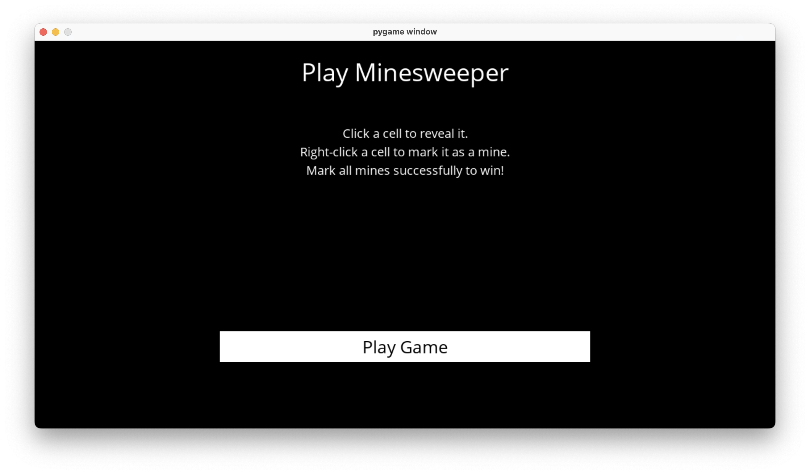

# Minesweeper
This Minesweeper game is developed using Pygame an uses prepositional logic to determine optimal moves to win the game.



## Getting Started
1. Clone this repository

    ```sh
    git clone git@github.com:richardl2003/Minesweeper.git
    ```

2. Navigate to the root directory of the cloned project, run `pip3 install -r requirements.txt` to install Pygame locally on your machine

3. Let the AI make the moves for you when stuck! :)